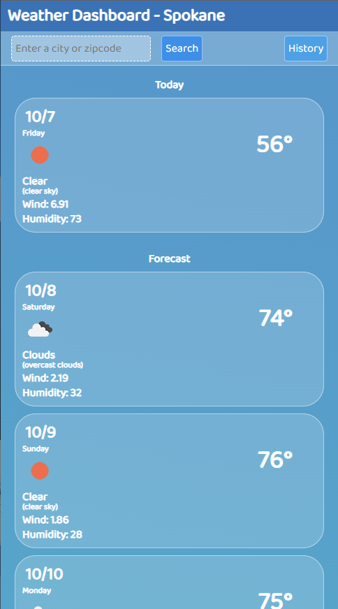

# Weather Dashboard

# Description
A weather tracking app utilizing data fetched from a third-party API ([https://openweathermap.org/](https://openweathermap.org/)). Enter a valid city or zip code to display it's current weather conditions, as well as a 5 day forecast. Search history will persist through visits using local storage, sorted by most recently viewed, and limited to 8. Error handling will present the user with a message if they make an invalid search. The search history will consolidate into a popup menu on smaller devices.

# Screenshots
## Desktop:

## Landscape:

## Portrait:

# Deployed
[https://vicdotexe.github.io/weather-dashboard/](https://vicdotexe.github.io/weather-dashboard/)
# Assignment

## *User Story*
```
AS A traveler
I WANT to see the weather outlook for multiple cities
SO THAT I can plan a trip accordingly
```
## *Acceptance Criteria*
```
GIVEN a weather dashboard with form inputs
WHEN I search for a city
THEN I am presented with current and future conditions for that city and that city is added to the search history
WHEN I view current weather conditions for that city
THEN I am presented with the city name, the date, an icon representation of weather conditions, the temperature, the humidity, and the wind speed
WHEN I view future weather conditions for that city
THEN I am presented with a 5-day forecast that displays the date, an icon representation of weather conditions, the temperature, the wind speed, and the humidity
WHEN I click on a city in the search history
THEN I am again presented with current and future conditions for that city
```

# License
[MIT Licence](https://github.com/vicdotexe/weather-dashboard/blob/main/LICENSE)